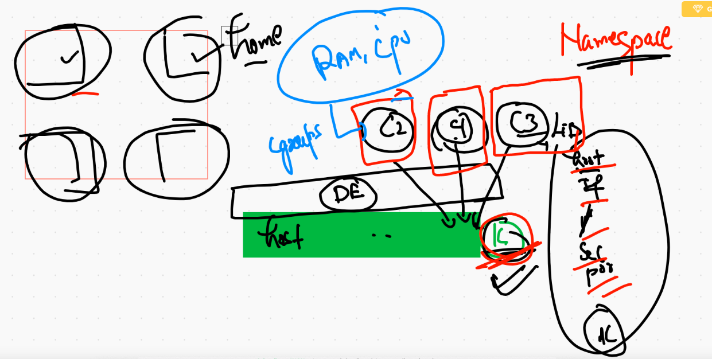
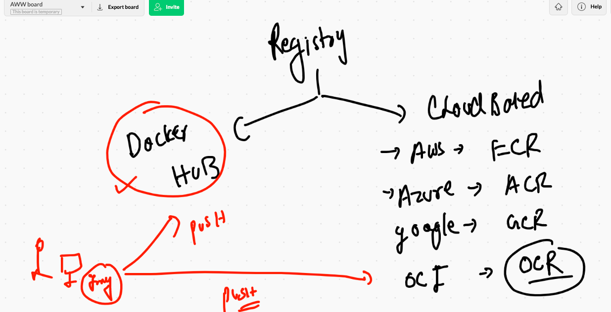
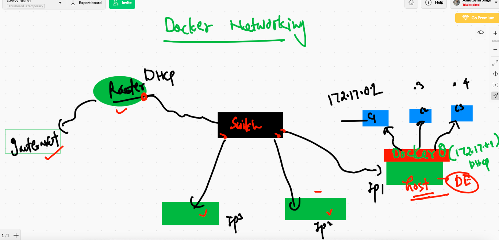
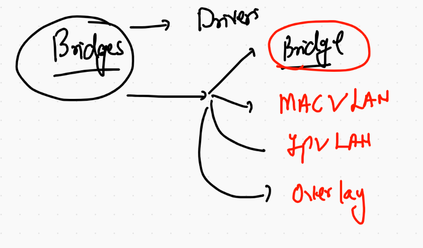
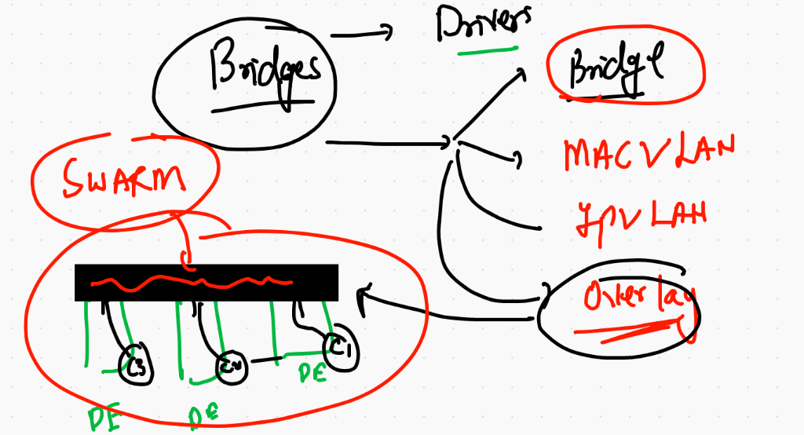
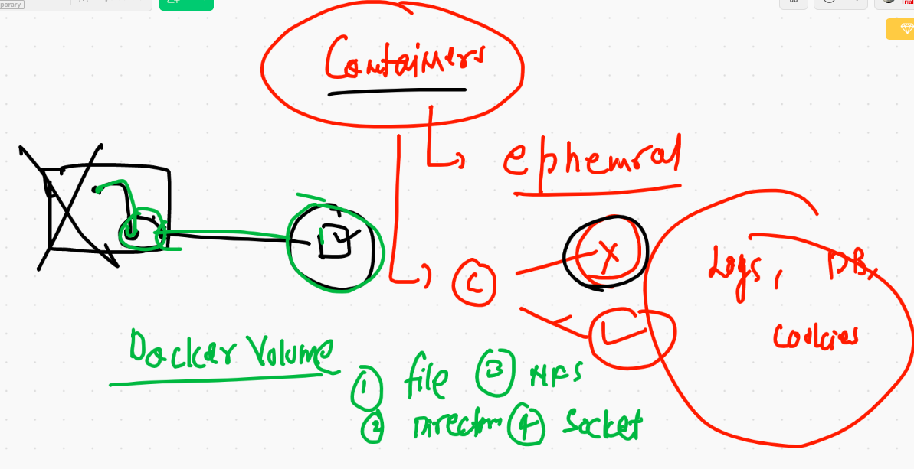

# Docker day1 REcap 


## Container namespace & cgroups



## Remote tcp allow 

```
[root@ip-172-31-93-149 ~]# cat  /etc/sysconfig/docker
# The max number of open files for the daemon itself, and all
# running containers.  The default value of 1048576 mirrors the value
# used by the systemd service unit.
DAEMON_MAXFILES=1048576

# Additional startup options for the Docker daemon, for example:
# OPTIONS="--ip-forward=true --iptables=true"
# By default we limit the number of open files per container
OPTIONS="--default-ulimit nofile=1024:4096 -H tcp://0.0.0.0:2375"

# How many seconds the sysvinit script waits for the pidfile to appear
# when starting the daemon.
DAEMON_PIDFILE_TIMEOUT=10


```

==

```
 6  systemctl daemon-reload 
    7  systemctl restart docker  
    
 ```
 # To remove all non running containers
 
 ```
 ❯ docker  rm  $(docker  ps -aq)
659b34920e2d
689cb14c5d72
1ababee8144d
aebf596da3c2
d155d9067fdf
954744efcdb7
3062504b51ac
11728f488948
0d5d7bcf6e9e
d1d787c08d67
99c27aef1ad1
aeb44a40ccd8

```

## Demo of Cgroups

```
6587  docker  run  -d --name  ashuc2  --memory 200m   busybox ping 127.0.0.1 
 6588  docker  ps
 6589  docker update  ashuc1  --memory 300m 
 6590  docker update  ashuc1  --help
 6591  docker update  ashuc1  --memory-swap  300m 
 6592  docker update  ashuc1  --memory-swap  200m 
 6593  docker update  ashuc1  --memory-swap  200m --force 
 6594  docker  ps
 6595  docker  pause  ashuc1 
 6596  docker  ps
 6597  docker  unpause  ashuc1 
 6598  docker  ps
❯ docker  run  -d --name  ashuc33  --memory 200m  --cpu-shares=30  busybox ping 127.0.0.1

```

## load & save 

```
❯ docker  save -o  hello.tar  alpine:latest
❯ ls
DevopsSRE                 beginner-html-site-styled helmprom                  techienest
OracleUStime_b1           cg.png                    or.token
PHD                       cre.png                   oraclecloud.key
backup                    hello.tar                 pythonapp
❯ docker rm $(docker ps -aq) -f
34f64cb08e06
3efb26c04b62
c804e5f43458
d7ef2b28a35c
❯ docker rmi alpine
Untagged: alpine:latest
Untagged: alpine@sha256:08d6ca16c60fe7490c03d10dc339d9fd8ea67c6466dea8d558526b1330a85930
❯ 
❯ docker load -i  hello.tar
Loaded image: alpine:latest

```

## Removal 

```
6607  docker rm $(docker ps -aq) -f
 6608  docker rmi alpine 
 6609  docker load -i  hello.tar
 6610  history
 6611  docker  images
 6612  docker rmi  $(docker images -q) -f
 
```

# Image registry 



## SYstemD support in Container 

```
[root@5cfcc08626f5 /]# systemctl start httpd
System has not been booted with systemd as init system (PID 1). Can't operate.
Failed to connect to bus: Host is down

```
## MUlti app docker images

```
6707  docker  build  -t   dockerashu/ows:v002   .  
 6708  docker rm $(docker ps -aq) -f
 6709  docker  run --name ashuc2 -e  x=app1   -d -p 1100:80  dockerashu/ows:v002  
 6710  docker  exec -it ashuc2  bash 
 6711  history
 6712  docker  run --name ashuc2 -e  x=app2   -d -p 1133:80  dockerashu/ows:v002  
 6713  docker  run --name ashuc3 -e  x=app2   -d -p 1133:80  dockerashu/ows:v002  
 6714  docker  run --name ashuc4 -e  x=app3   -d -p 1144:80  dockerashu/ows:v002

```

# Docker NEtworking 



## checking default bridge 

```
❯ docker network ls
NETWORK ID     NAME      DRIVER    SCOPE
61ab55f99b48   bridge    bridge    local
b4749a3c3fb4   host      host      local
983bf0753fea   none      null      local
❯ docker network inspect  bridge
[
    {
        "Name": "bridge",
        "Id": "61ab55f99b48a24ee2b489ac9dbc7affc5ad56b85842fee9499b6846105bd75d",
        "Created": "2021-02-09T19:23:56.031277229Z",
        "Scope": "local",
        "Driver": "bridge",
        "EnableIPv6": false,
        "IPAM": {
            "Driver": "default",
            "Options": null,
            "Config": [
                {
                    "Subnet": "172.17.0.0/16",
                    "Gateway": "172.17.0.1"
                }
            ]
        },
        "Internal": false,
        "Attachable": false,
        "Ingress": false,
        "ConfigFrom": {
            "Network": ""
        },
        "ConfigOnly": false,
        "Containers": {},
        "Options": {
            "com.docker.network.bridge.default_bridge": "true",
            "com.docker.network.bridge.enable_icc": "true",
            "com.docker.network.bridge.enable_ip_masquerade": "true",
            "com.docker.network.bridge.host_binding_ipv4": "0.0.0.0",
            "com.docker.network.bridge.name": "docker0",
            "com.docker.network.driver.mtu": "1500"
        },
        "Labels": {}
    }
]

```
## checking ip of running container 

```
❯ docker  inspect  x1  |   grep -i ipaddress
            "SecondaryIPAddresses": null,
            "IPAddress": "172.17.0.2",
                    "IPAddress": "172.17.0.2",
                    
 ```
 
 ## NAT 
 
 
 
 ## Port forwarding 
 
 
 
 ## Creating custom bridge with automatic network series 
 
 ```
 ❯ docker  network  create   ashubr1
fa4005bb0accb376625e73b47e71c1e3731a1fe54c4abeb1102fab0cea9af7ab
❯ docker  network  ls
NETWORK ID     NAME      DRIVER    SCOPE
fa4005bb0acc   ashubr1   bridge    local
61ab55f99b48   bridge    bridge    local
b4749a3c3fb4   host      host      local
983bf0753fea   none      null      local
❯ docker  network  inspect  ashubr1
[
    {
        "Name": "ashubr1",
        "Id": "fa4005bb0accb376625e73b47e71c1e3731a1fe54c4abeb1102fab0cea9af7ab",
        "Created": "2021-02-09T21:40:14.077132807Z",
        "Scope": "local",
        "Driver": "bridge",
        "EnableIPv6": false,
        "IPAM": {
            "Driver": "default",
            "Options": {},
            "Config": [
                {
                    "Subnet": "172.18.0.0/16",
                    "Gateway": "172.18.0.1"
                    
   ```
  
## container 

```
6785  docker  network  inspect  ashubr1 
 6786  docker run -d --name br1x1    --network ashubr1   alpine ping 127.0.0.2 
 6787  docker run -d --name br1x2    --network ashubr1   alpine ping 127.0.0.2 
 6788  docker  network  inspect  ashubr1 

```
## custom bridge with custom subnet 

```
6795  docker network create  ashubr2  --subnet  192.167.0.0/16 
 6796  docker network ls
 6797  docker  run -d --name br2x1 --network  ashubr2  alpine ping 127.0.0.1 
 6798  docker exec -it  br2x1 sh 
 6799  docker  run -d --name br2x2  --network  ashubr2  --ip 192.167.0.100 alpine ping 127.0.0.1 
 6800  docker exec -it  br2x2 sh 
 
 ```
 ## container with multiple bridge 
 
 ```
 ❯ docker network connect  ashubr2  br1x1
❯ docker  exec -it  br1x1  sh
/ # ifconfig 
eth0      Link encap:Ethernet  HWaddr 02:42:AC:12:00:02  
          inet addr:172.18.0.2  Bcast:172.18.255.255  Mask:255.255.0.0
          UP BROADCAST RUNNING MULTICAST  MTU:1500  Metric:1
          RX packets:27 errors:0 dropped:0 overruns:0 frame:0
          TX packets:19 errors:0 dropped:0 overruns:0 carrier:0
          collisions:0 txqueuelen:0 
          RX bytes:2110 (2.0 KiB)  TX bytes:1638 (1.5 KiB)

eth1      Link encap:Ethernet  HWaddr 02:42:C0:A7:00:03  
          inet addr:192.167.0.3  Bcast:192.167.255.255  Mask:255.255.0.0
          UP BROADCAST RUNNING MULTICAST  MTU:1500  Metric:1
          RX packets:7 errors:0 dropped:0 overruns:0 frame:0
          TX packets:0 errors:0 dropped:0 overruns:0 carrier:0
          collisions:0 txqueuelen:0 
          RX bytes:586 (586.0 B)  TX bytes:0 (0.0 B)
          
 ```
 
 ## Disconnect from bridge
 
 ```
 ❯ docker network disconnect  ashubr2  br1x1
❯ docker  exec -it  br1x1  sh
/ # ifconfig 
eth0      Link encap:Ethernet  HWaddr 02:42:AC:12:00:02  
          inet addr:172.18.0.2  Bcast:172.18.255.255  Mask:255.255.0.0
          UP BROADCAST RUNNING MULTICAST  MTU:1500  Metric:1
          RX packets:27 errors:0 dropped:0 overruns:0 frame:0
          TX packets:19 errors:0 dropped:0 overruns:0 carrier:0
          collisions:0 txqueuelen:0 
          RX bytes:2110 (2.0 KiB)  TX bytes:1638 (1.5 KiB)

lo        Link encap:Local Loopback  
          inet addr:127.0.0.1  Mask:255.0.0.0
          UP LOOPBACK RUNNING  MTU:65536  Metric:1
          RX packets:1920 errors:0 dropped:0 overruns:0 frame:0
          TX packets:1920 errors:0 dropped:0 overruns:0 carrier:0
          collisions:0 txqueuelen:1000 
          RX bytes:160947 (157.1 KiB)  TX bytes:160947 (157.1 KiB)
          
          
  ```
  
  ## Network history 
  
  ```
  6782  docker  network  ls
 6783  docker  network  create   ashubr1 
 6784  docker  network  ls
 6785  docker  network  inspect  ashubr1 
 6786  docker run -d --name br1x1    --network ashubr1   alpine ping 127.0.0.2 
 6787  docker run -d --name br1x2    --network ashubr1   alpine ping 127.0.0.2 
 6788  docker  network  inspect  ashubr1 
 6789  history
 6790  docker  exec -it  br1x1  sh 
 6791  history
 6792  docker  exec -it  br1x1  sh 
 6793  history
 6794  docker  exec -it  br1x1  sh 
 6795  docker network create  ashubr2  --subnet  192.167.0.0/16 
 6796  docker network ls
 6797  docker  run -d --name br2x1 --network  ashubr2  alpine ping 127.0.0.1 
 6798  docker exec -it  br2x1 sh 
 6799  docker  run -d --name br2x2  --network  ashubr2  --ip 192.167.0.100 alpine ping 127.0.0.1 
 6800  docker exec -it  br2x2 sh 
 6801  history
 6802  docker network ls
 6803  docker  exec -it  br1x1  sh 
 6804  docker network connect  ashubr2  br1x1 
 6805  docker  exec -it  br1x1  sh 
 6806  history
 6807  docker network disconnect  ashubr2  br1x1 
 6808  docker  exec -it  br1x1  sh 


```

# Docker networking Drivers



## Macvlan 

[macvlan](https://docs.docker.com/network/macvlan/)

## overlay




# Storage 


## changing default docker engine storage

```
[root@ip-172-31-93-149 ~]# cd /etc/sysconfig/
[root@ip-172-31-93-149 sysconfig]# ls
acpid       clock     docker          i18n        man-db      network-scripts  readonly-root  rsyslog    sysstat
atd         console   docker-storage  init        modules     nfs              rpc-rquotad    run-parts  sysstat.ioconf
authconfig  cpupower  grub            irqbalance  netconsole  raid-check       rpcbind        selinux
chronyd     crond     htcacheclean    keyboard    network     rdisc            rsyncd         sshd
[root@ip-172-31-93-149 sysconfig]# vim docker
[root@ip-172-31-93-149 sysconfig]# cat  docker
# The max number of open files for the daemon itself, and all
# running containers.  The default value of 1048576 mirrors the value
# used by the systemd service unit.
DAEMON_MAXFILES=1048576

# Additional startup options for the Docker daemon, for example:
# OPTIONS="--ip-forward=true --iptables=true"
# By default we limit the number of open files per container
OPTIONS="--default-ulimit nofile=1024:4096 -H tcp://0.0.0.0:2375 -g  /mnt/oracle"

# How many seconds the sysvinit script waits for the pidfile to appear
# when starting the daemon.
DAEMON_PIDFILE_TIMEOUT=10
[root@ip-172-31-93-149 sysconfig]# systemctl daemon-reload 
[root@ip-172-31-93-149 sysconfig]# systemctl restart docker 

```

## Restoring data from old to new location 

```
 rsync -avp /var/lib/docker/  /mnt/oracle/
 systemctl restart docker 
 
```
## engine storage 

[storage](https://github.com/redashu/docker/tree/master/docker_storage)

# Container storage 



## Creating volume 

```
❯ docker volume  create  ashuvol1
ashuvol1
❯ docker volume  ls
DRIVER    VOLUME NAME
local     ashuvol1
❯ docker volume  inspect  ashuvol1
[
    {
        "CreatedAt": "2021-02-09T23:18:19Z",
        "Driver": "local",
        "Labels": {},
        "Mountpoint": "/mnt/oracle/volumes/ashuvol1/_data",
        "Name": "ashuvol1",
        "Options": {},
        "Scope": "local"
    }
]


```

docker run  -it  --name x3  -v  ashuvol1:/ok:ro   centos bash

## Container with No network but shared volume 

```
❯ docker  network  ls
NETWORK ID     NAME         DRIVER    SCOPE
fa4005bb0acc   ashubr1      bridge    local
e251db264e61   ashubr2      bridge    local
352c4c3fede0   bridge       bridge    local
b4749a3c3fb4   host         host      local
753cf59dcb15   jlrday2br1   bridge    local
983bf0753fea   none         null      local
❯ docker  run -it --network none  alpine sh
/ # ifconfig 
lo        Link encap:Local Loopback  
          inet addr:127.0.0.1  Mask:255.0.0.0
          UP LOOPBACK RUNNING  MTU:65536  Metric:1
          RX packets:0 errors:0 dropped:0 overruns:0 frame:0
          TX packets:0 errors:0 dropped:0 overruns:0 carrier:0
          collisions:0 txqueuelen:1000 
          RX bytes:0 (0.0 B)  TX bytes:0 (0.0 B)

/ # ping google.com 
^C
/ # exit
❯ docker  run -it --network none -v  ashuvol1:/mnt/fine  alpine sh
/ # cd /mnt/fine/
/mnt/fine # ls
a.txt  hello  nice   world
/mnt/fine # 

```
