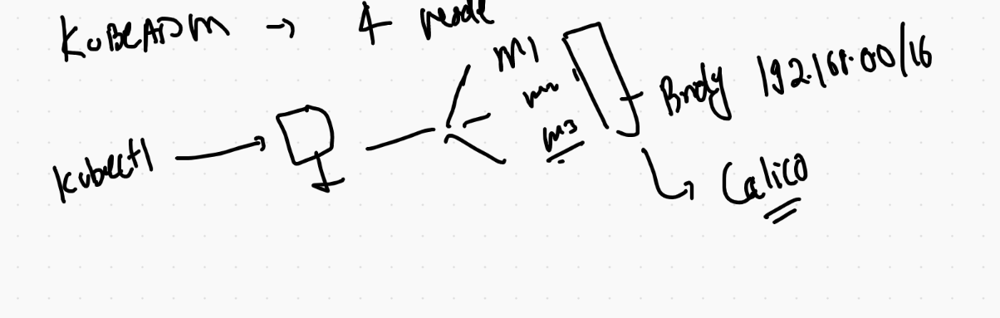
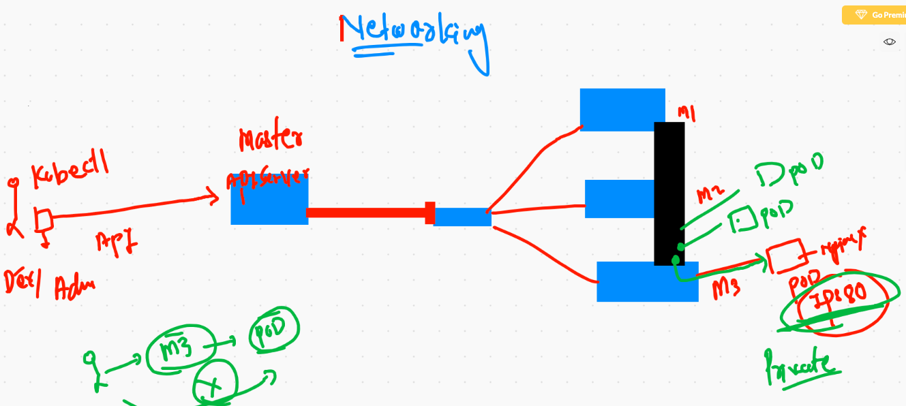
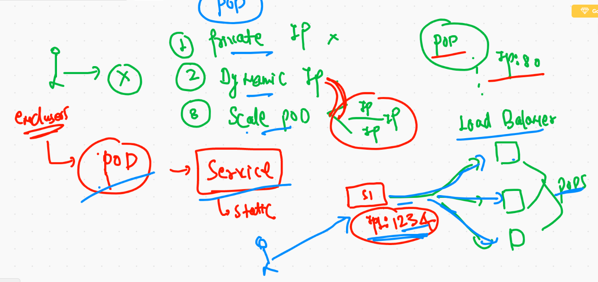
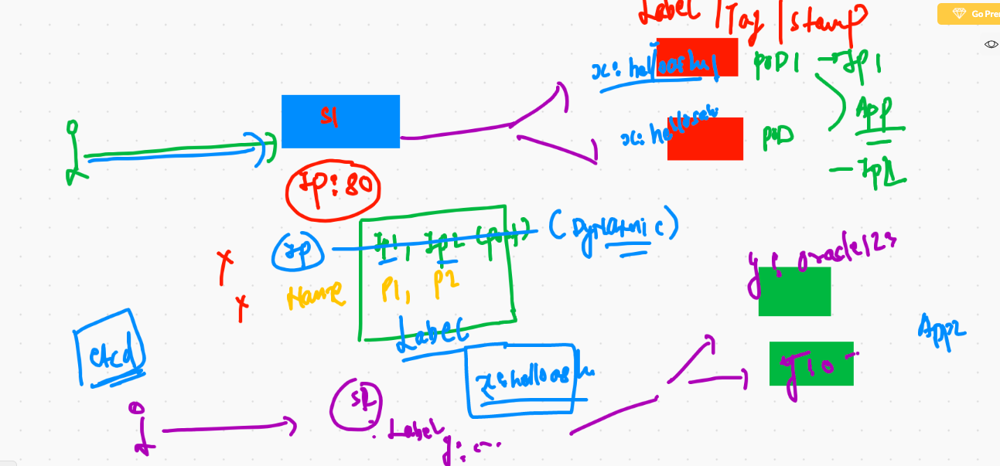
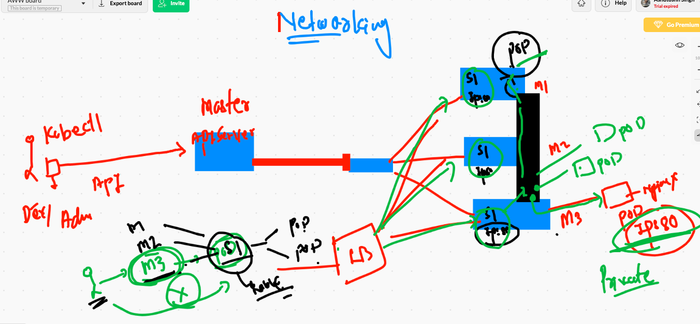
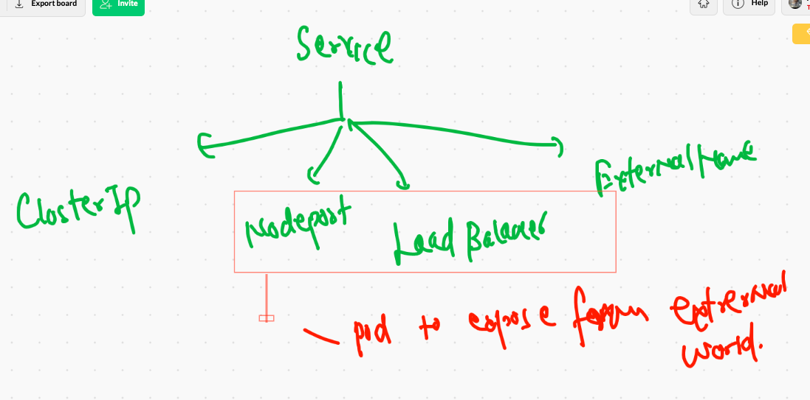
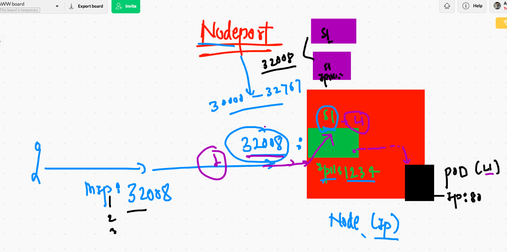
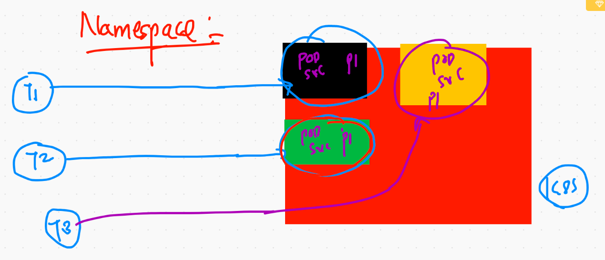
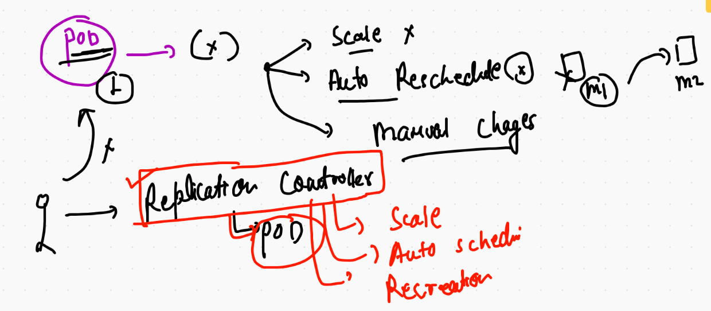

# K8s multi node cluster using kubeadm 

## Step 1 -- hostname setup 

## step 2 IN all the Node 

```
yum  install docker  -y  ;  systemctl enable --now docker

```

## step 3  disable swap & selinux during installation time  (ALL Nodes)

## step 4. enable kernel driver for kube-proxy 

```
[root@k8s-master ~]# modprobe br_netfilter
[root@k8s-master ~]# echo '1' > /proc/sys/net/bridge/bridge-nf-call-iptables
```

## stpe 5 install kubeadm in all the nodes 

```
cat  <<EOF  >/etc/yum.repos.d/kube.repo
[kube]
baseurl=https://packages.cloud.google.com/yum/repos/kubernetes-el7-x86_64
gpgcheck=0
EOF

yum install kubeadm -y
systemctl enable --now kubelet

```

#  THis one you have to do in the machine you want to configure as Master Node 

```
[root@k8s-master ~]# kubeadm  init  --pod-network-cidr=192.168.0.0/16  --apiserver-advertise-address=0.0.0.0 --apiserver-cert-extra-sans=34.198.161.17  
[init] Using Kubernetes version: v1.20.2
[preflight] Running pre-flight checks
	[WARNING IsDockerSystemdCheck]: detected "cgroupfs" as the Docker cgroup driver. The recommended driver is "systemd". Please follow the guide at https://kubernetes.io/docs/setup/cri/
	[WARNING FileExisting-tc]: tc not found in system path
	[WARNING Hostname]: hostname "k8s-master" could not be reached
	[WARNING Hostname]: hostname "k8s-master": lookup k8s-master on 172.31.0.2:53: no such host
[preflight] Pulling images required for setting up a Kubernetes cluster
[preflight] This might take a minute or two, depending on the speed of your internet connection
[preflight] You can also perform this action in beforehand using 'kubeadm config images pull'


```
  
  
## client connect 

```
root@k8s-master ~]# cd  /etc/kubernetes/
[root@k8s-master kubernetes]# ls
admin.conf 

```


## setting env 

```
export KUBECONFIG=/Users/fire/Desktop/admin.conf

```

# POd deployment 

```
❯ kubectl get  po
NAME         READY   STATUS    RESTARTS   AGE
ashupod-2    1/1     Running   0          63s
muthupod-1   1/1     Running   0          17s
vgpod-1      1/1     Running   0          53s
❯ kubectl get  po  -o wide
NAME         READY   STATUS    RESTARTS   AGE   IP              NODE          NOMINATED NODE   READINESS GATES
ashupod-2    1/1     Running   0          69s   192.168.214.1   k8s-minion3   <none>           <none>
jlrd3pod-1   1/1     Running   0          6s    192.168.214.3   k8s-minion3   <none>           <none>
muthupod-1   1/1     Running   0          23s   192.168.54.66   k8s-minion1   <none>           <none>
vgpod-1      1/1     Running   0          59s   192.168.214.2   k8s-minion3   <none>           <none>
❯ kubectl get  po  -o wide


```
## access app using kubeconfig file 

```
❯ kubectl  port-forward   ashupod-2  1244:80
Forwarding from 127.0.0.1:1244 -> 80
Forwarding from [::1]:1244 -> 80
Handling connection for 1244
Handling connection for 1244

```
## kubeadm summary 



## k8s networking 



## pod ip problems 



## service use label of pod



## service with LB 



## service type 



# checking label 

```
❯ kubectl apply -f  ashupod1.yaml
pod/ashupod-2 configured
❯ kubec get po ashupod-2  --show-labels
zsh: command not found: kubec
❯ kubectl  get po ashupod-2  --show-labels
NAME        READY   STATUS    RESTARTS   AGE   LABELS
ashupod-2   1/1     Running   0          78m   x=helloashuapp1
❯ kubectl  get po --show-labels
NAME                             READY   STATUS              RESTARTS   AGE   LABELS
ashupod-2                        1/1     Running             0          78m   x=helloashuapp1
charles-nginx-857566c655-d9c4x   1/1     Running             0          61m   app=charles-nginx,pod-template-hash=857566c655
greg-1                           1/1     Running             0          73m   <none>
grgrpod-1                        1/1     Running             0          73m   <none>
japppod                          1/1     Running             0          76m   run=japppod
japppod1                         1/1     Running             0          47m   run=japppod1
jlrd3pod-1                       1/1     Running             0          77m   <none>

```

## NodePOrt 



## creation of service 

```
❯ kubectl  create  service nodeport  ashusvc1  --tcp 1234:80  --dry-run=client  -o yaml
apiVersion: v1
kind: Service
metadata:
  creationTimestamp: null
  labels:
    app: ashusvc1
  name: ashusvc1
spec:
  ports:
  - name: 1234-80
    port: 1234
    protocol: TCP
    targetPort: 80
  selector:
    app: ashusvc1
  type: NodePort
status:
  loadBalancer: {}
❯ kubectl  create  service nodeport  ashusvc1  --tcp 1234:80  --dry-run=client  -o yaml   >ashusvc1.yaml

```

## gettting service 

```

❯ kubectl  get  service
NAME          TYPE        CLUSTER-IP       EXTERNAL-IP   PORT(S)          AGE
ashusvc1      NodePort    10.110.6.1       <none>        1234:31202/TCP   3m28s
gcolesvc1     NodePort    10.99.39.249     <none>        1234:30650/TCP   3m39s
grgrsrv1      NodePort    10.107.104.221   <none>        1234:32425/TCP   3m5s
jappsvc       NodePort    10.108.247.161   <none>        1234:30911/TCP   3m4s
jlrd4svc1     NodePort    10.100.242.144   <none>        3345:31880/TCP   3m8s
kubernetes    ClusterIP   10.96.0.1  

```


## NEw pod 

```
❯ kubectl   run  ashunewpod --image=dockerashu/ows:v002 --port 80  --dry-run=client -o yaml
apiVersion: v1
kind: Pod
metadata:
  creationTimestamp: null
  labels:
    run: ashunewpod
  name: ashunewpod
spec:
  containers:
  - image: dockerashu/ows:v002
    name: ashunewpod
    ports:
    - containerPort: 80
    resources: {}
  dnsPolicy: ClusterFirst
  restartPolicy: Always
status: {}
❯ kubectl   run  ashunewpod --image=dockerashu/ows:v002 --port 80  --dry-run=client -o yaml  >ashunewpod.yaml

```

## adding env 

```
apiVersion: v1
kind: Pod
metadata:
  creationTimestamp: null
  labels: # label of POD 
    run: ashunewpod
  name: ashunewpod # name of pod 
spec:
  containers:
  - image: dockerashu/ows:v002
    name: ashunewpod
    ports:
    - containerPort: 80
    env:  # this is for putting/replacing env variable 
    - name: x # docker run -e x=app1  
      value: app1 
    resources: {}
  dnsPolicy: ClusterFirst
  restartPolicy: Always
status: {}


```

# Adding pod and svc in same yaml 

```
apiVersion: v1
kind: Pod
metadata:
  creationTimestamp: null
  labels: # label of POD 
    run: ashunewpod
  name: ashunewpod # name of pod 
spec:
  containers:
  - image: dockerashu/ows:v002
    name: ashunewpod
    ports:
    - containerPort: 80
    env:  # this is for putting/replacing env variable 
    - name: x # docker run -e x=app1  
      value: app1 
    resources: {}
  dnsPolicy: ClusterFirst
  restartPolicy: Always
status: {}

---

apiVersion: v1
kind: Service
metadata:
 name: ashusvc3344
spec:
 ports:
 - name: ashport
   port: 1234 # serivce port 
   protocol: TCP
   targetPort: 80 # pod port that runs application 
 type: NodePort
 selector:
  run: ashunewpod # exactly same label of POD 


```

## Exposing pod to create service 

```
7085  kubectl  expose  pod  ashunewpod  --type NodePort  --port 1234 --target-port 80 --name ashusvc099 
 7086  kubectl  expose  pod  ashunewpod  --type NodePort  --port 80  --name ashusvc011 


```

## pod with custom parent process


```
apiVersion: v1
kind: Pod
metadata:
  creationTimestamp: null
  labels:
    run: helloashu
  name: helloashu
spec:
  containers:
  - image: alpine
    name: helloashu
    command: ["/bin/sh","-c","ping fb.com"] # parent process of container
    resources: {}  # command is for replacing ENTRYPOINT parent process 
  dnsPolicy: ClusterFirst
  restartPolicy: Never
status: {}


```

## more commands 

```
❯ kubectl replace -f alp.yml --force
pod "helloashu" deleted
pod/helloashu replaced
❯ kubectl  get  po
NAME        READY   STATUS    RESTARTS   AGE
helloashu   1/1     Running   0          6s
❯ kubectl  logs  -f  helloashu
PING fb.com (157.240.218.35): 56 data bytes
64 bytes from 157.240.218.35: seq=0 ttl=36 time=89.942 ms
64 bytes from 157.240.218.35: seq=1 ttl=36 time=84.924 ms
64 bytes from 157.240.218.35: seq=2 ttl=36 time=83.588 ms
64 bytes from 157.240.218.35: seq=3 ttl=36 time=82.610 ms
64 bytes from 157.240.218.35: seq=4 ttl=36 time=83.813 ms
64 bytes from 157.240.218.35: seq=5 ttl=36 time=85.302 ms
64 bytes from 157.240.218.35: seq=6 ttl=36 time=83.218 ms
64 bytes from 157.240.218.35: seq=7 ttl=36 time=85.096 ms
64 bytes from 157.240.218.35: seq=8 ttl=36 time=82.716 ms
64 bytes from 157.240.218.35: seq=9 ttl=36 time=85.125 ms
64 bytes from 157.240.218.35: seq=10 ttl=36 time=84.753 ms
64 bytes from 157.240.218.35: seq=11 ttl=36 time=83.619 ms
64 bytes from 157.240.218.35: seq=12 ttl=36 time=85.133 ms
64 bytes from 157.240.218.35: seq=13 ttl=36 time=82.643 ms
64 bytes from 157.240.218.35: seq=14 ttl=36 time=83.828 ms
64 bytes from 157.240.218.35: seq=15 ttl=36 time=85.036 ms
^C
❯ kubectl exec -it helloashu -- sh
/ # 
/ # 
/ # cat  /etc/os-release 
NAME="Alpine Linux"
ID=alpine
VERSION_ID=3.13.1
PRETTY_NAME="Alpine Linux v3.13"
HOME_URL="https://alpinelinux.org/"
BUG_REPORT_URL="https://bugs.alpinelinux.org/"
/ # exit

```

# namespace 



## creating namespace 

```
❯ kubectl create  namespace  ashu-space
namespace/ashu-space created
❯ kubectl  get  ns
NAME              STATUS   AGE
ashu-space        Active   5s
default           Active   5h5m
kube-node-lease   Active   5h5m
kube-public       Active   5h5m
kube-system       Active   5h5m

```


## change default namespace 

```
kubectl   config set-context  --current  --namespace=ashu-space

```

# Replication controller (RC)



## RC 

```
apiVersion: v1
kind: ReplicationController
metadata:
 namespace: ashu-space 
 name: ashu-rc1 # name of RC 
 labels:  # label of RC 
  x: helloashurc
spec: # info about POD 
 replicas: 1  # no of Pod to be created  
 template: # RC will use template to create POD
  metadata:
   labels: # label of PODs 
    x: ashunewpod  
  spec:
   containers:
   - image: dockerashu/ows:v002
     name: ashuc11
     ports:
     - containerPort: 80
     env: 
     - name: x
       value: app2
  
 ```
 


