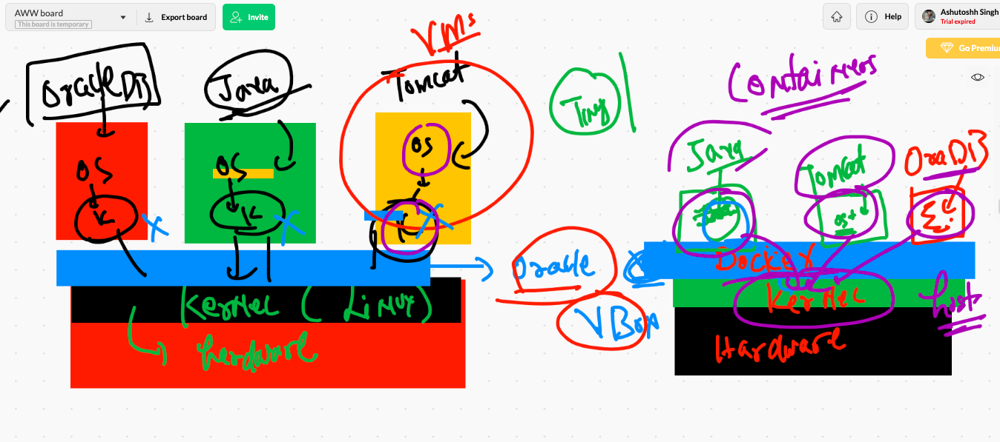
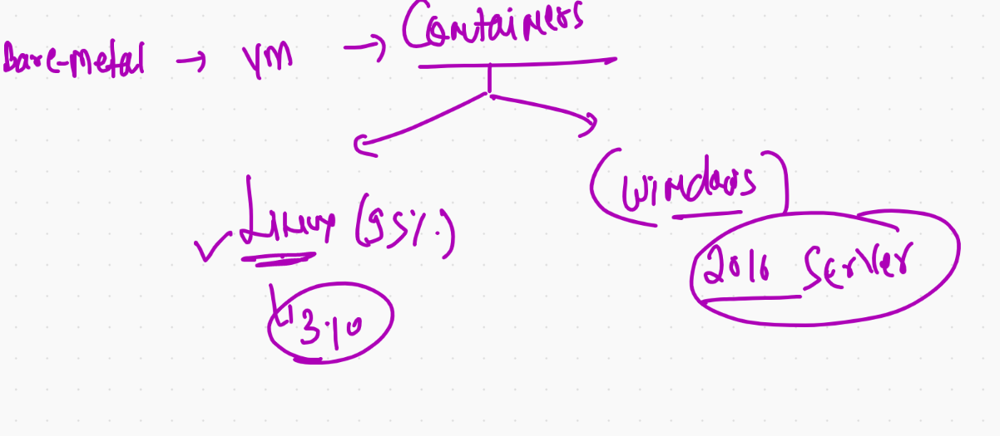

# Day1 starting 

## understanding OS kernel 


## vm vs container 



## container type 



## Container Runtime engine 


## Docker products 


## COnnecting to Remote Docker engine 

```
❯ docker  context  create   oracleDE  --docker  "host=tcp://3.210.139.97:2375"
oracleDE
Successfully created context "oracleDE"
❯ docker  context  ls
NAME                TYPE                DESCRIPTION                               DOCKER ENDPOINT               KUBERNETES ENDPOINT                        ORCHESTRATOR
ashude              moby                                                          tcp://3.84.170.96:2375                                                   
default *           moby                Current DOCKER_HOST based configuration   unix:///var/run/docker.sock   https://52.205.97.11:6443 (ashuproject1)   swarm
oracleDE            moby                                                          tcp://3.210.139.97:2375                                                  
❯ docker  context  use  oracleDE
oracleDE
❯ docker  context  ls
NAME                TYPE                DESCRIPTION                               DOCKER ENDPOINT               KUBERNETES ENDPOINT                        ORCHESTRATOR
ashude              moby                                                          tcp://3.84.170.96:2375                                                   
default             moby                Current DOCKER_HOST based configuration   unix:///var/run/docker.sock   https://52.205.97.11:6443 (ashuproject1)   swarm
oracleDE *          moby                                                          tcp://3.210.139.97:2375                                                  


```


