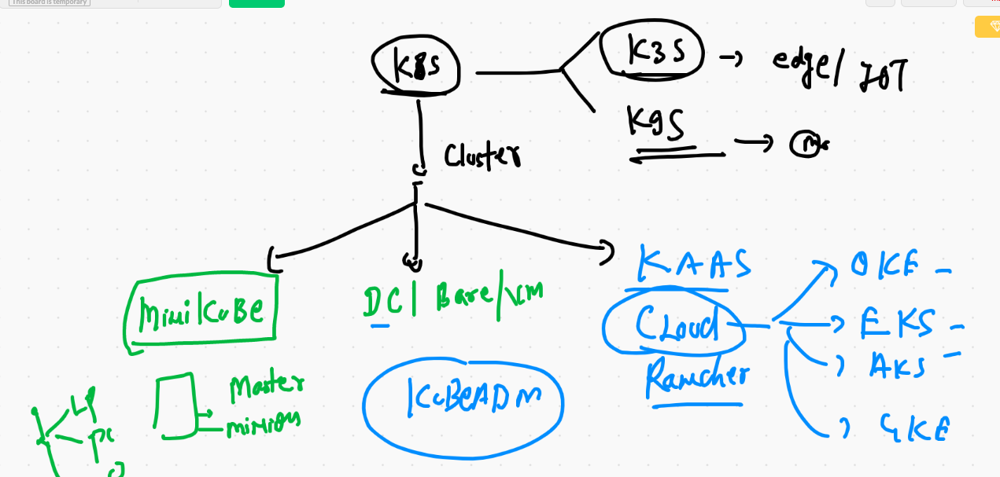

# COmpose start 


# Docker compose version history 

[version](https://docs.docker.com/compose/compose-file/)

## INstall docker compose 

[compose]('https://docs.docker.com/compose/install/')

# COMpose examples 

## Example 1 

```
version: "3.8" # compose file version
services: # to define one or more container applications
 ashuapp1: # name of app 
  image: alpine # image 
  container_name: ashuc1 # name of container 
  command: ping 127.0.0.1 # parent process
  restart: always  # restart policy 
  
```

## RUnning compose file

```
❯ docker-compose up  -d
Creating network "composedeploy_default" with the default driver
Creating ashuc1 ... done
❯ docker-compose ps
 Name       Command       State   Ports
---------------------------------------
ashuc1   ping 127.0.0.1   Up      

```
## more instruction 

```
❯ docker-compose   stop
Stopping ashuc1 ... done
❯ docker-compose   start
Starting ashuapp1 ... done
❯ docker-compose   kill
Killing ashuc1 ... done
❯ docker-compose   ps
 Name       Command        State     Ports
------------------------------------------
ashuc1   ping 127.0.0.1   Exit 137        
❯ docker-compose   start
Starting ashuapp1 ... done

```

## Example 2 

```
version: "3.8" # compose file version
services: # to define one or more container applications
 ashuapp1: # name of app 
  image: alpine # image 
  container_name: ashuc1 # name of container 
  command: ping 127.0.0.1 # parent process
  restart: always  # restart policy 

 ashuapp2: # second app
  image: nginx
  container_name: ashuc2
  ports:
   - "1122:80" # - means array in YAML 
  restart: always # best practise to use (optional)

# docker run -d --name ashuc2 -p 1122:80 --restart always nginx 

```

## more commands 

```
6907  docker-compose up -d
 6908  docker-compose ps 
 6909  docker-compose kill 
 6910  docker-compose start  ashuapp1 
 6911  docker-compose ps
 6912  docker-compose kill ashuapp1
 6913  docker-compose start
 6914  docker-compose ps
 6915  docker-compose logs ashuapp1
 6916  docker-compose logs ashuapp2
❯ docker-compose down
Stopping ashuc2 ... done
Stopping ashuc1 ... done
Removing ashuc2 ... done
Removing ashuc1 ... done
Removing network composedeploy_default


```

## Example 3 

```
version: "3.6"
networks: # to create network 
 ashubr1234: # name of network with default bridge driver
volumes: # to create volume 
 ashuvol123: # name of volume 

services:
 ashuapp11:
  image: nginx
  container_name: xcashu1
  networks: # for using networks 
  - ashubr1234
  volumes: # using volume 
  - ashuvol123:/mnt/oracle  
  ports:
  - 1199:80 
  
 ```
 
 ## deployment 
 
 ```
 ❯ ls
ashu.yml            docker-compose.yaml
❯ docker-compose -f  ashu.yml up  -d
Creating network "composedeploy_ashubr1234" with the default driver
Creating volume "composedeploy_ashuvol123" with default driver
Creating xcashu1 ... done
❯ docker-compose -f  ashu.yml   ps
 Name                Command               State          Ports        
-----------------------------------------------------------------------
xcashu1   /docker-entrypoint.sh ngin ...   Up      0.0.0.0:1199->80/tcp
❯ docker-compose -f  ashu.yml  down
Stopping xcashu1 ... done
Removing xcashu1 ... done
Removing network composedeploy_ashubr1234

```
# Example 3 

```
version: '3.8'
services:
  ashujsp1:
    image: dockerashu/ashujava:webappv1 # name of image i want to build
    build: # to build image from Dockerfile 
      context: . # location of Dockerfile 
      dockerfile: Dockerfile # name of dockerfile 
    container_name: ashujavac1
    ports:
      - 5566:8080 
    restart: always 
    
  ```
  
  ## compsoe command history 
  
  ```
  6925  docker-compose -f  ashu.yml up  -d
 6926  docker-compose -f  ashu.yml   ps
 6927  docker-compose -f  ashu.yml  down
 6928  history
 6929  docker volume  ls
 6930  docker volume  inspect  ashuvol2  
 6931* ssh -i Downloads/macdocker.pem ec2-user@3.210.139.97
 6932  history
 6933  docker volume ls
 6934  docker  pull tomcat 
 6935  docker  inspect  tomcat 
 6936  history
 6937  ls
 6938  cd  javawebapp-master
 6939  ls
 6940  docker-compose up -d 
 6941  docker-compose ps
 6942  docker-compose down 
 6943  docker-compose down --remove-orphans
 6944  docker-compose up  --build   -d  
 6945  docker-compose ps


```

# COntainer orchestration engines 


## K8s more info 


## k8s architecture  Pic 1


## k8s arch pic 2


## k8s arch final


# k8s cluster deployment 



## Minikube install on Mac OS 

```
❯ curl -LO https://storage.googleapis.com/minikube/releases/latest/minikube-darwin-amd64
  % Total    % Received % Xferd  Average Speed   Time    Time     Time  Current
                                 Dload  Upload   Total   Spent    Left  Speed
100 52.6M  100 52.6M    0     0  8843k      0  0:00:06  0:00:06 --:--:-- 12.4M
❯ sudo install minikube-darwin-amd64 /usr/local/bin/minikube
Password:
❯ minikube version
minikube version: v1.17.1
commit: 043bdca07e54ab6e4fc0457e3064048f34133d7e

```

## docker driver 

```
https://minikube.sigs.k8s.io/docs/drivers/

```

## MInikube based cluster 

```
❯ minikube start --driver=docker
😄  minikube v1.17.1 on Darwin 11.2.1
✨  Using the docker driver based on user configuration
👍  Starting control plane node minikube in cluster minikube
🔥  Creating docker container (CPUs=2, Memory=1990MB) ...
🐳  Preparing Kubernetes v1.20.2 on Docker 20.10.2 ...
    ▪ Generating certificates and keys ...
    ▪ Booting up control plane ...
    ▪ Configuring RBAC rules ...
🔎  Verifying Kubernetes components...
🌟  Enabled addons: storage-provisioner, default-storageclass
🏄  Done! kubectl is now configured to use "minikube" cluster and "default" namespace by default
❯ minikube status
minikube
type: Control Plane
host: Running
kubelet: Running
apiserver: Running
kubeconfig: Configured
timeToStop: Nonexistent

```

## kubectl as the client of kubernetes got installed 

```
❯ curl -LO "https://dl.k8s.io/release/$(curl -L -s https://dl.k8s.io/release/stable.txt)/bin/darwin/amd64/kubectl"
  % Total    % Received % Xferd  Average Speed   Time    Time     Time  Current
                                 Dload  Upload   Total   Spent    Left  Speed
100   161  100   161    0     0    509      0 --:--:-- --:--:-- --:--:--   509
100 44.0M  100 44.0M    0     0  6350k      0  0:00:07  0:00:07 --:--:-- 10.1M
❯ chmod +x ./kubectl
❯ sudo mv ./kubectl /usr/local/bin/kubectl
Password:
❯ kubectl version --client
Client Version: version.Info{Major:"1", Minor:"20", GitVersion:"v1.20.2", GitCommit:"faecb196815e248d3ecfb03c680a4507229c2a56", GitTreeState:"clean", BuildDate:"2021-01-13T13:28:09Z", GoVersion:"go1.15.5", Compiler:"gc", Platform:"darwin/amd64"}

```

## 

```
❯ kubectl  version
Client Version: version.Info{Major:"1", Minor:"20", GitVersion:"v1.20.2", GitCommit:"faecb196815e248d3ecfb03c680a4507229c2a56", GitTreeState:"clean", BuildDate:"2021-01-13T13:28:09Z", GoVersion:"go1.15.5", Compiler:"gc", Platform:"darwin/amd64"}
Server Version: version.Info{Major:"1", Minor:"20", GitVersion:"v1.20.2", GitCommit:"faecb196815e248d3ecfb03c680a4507229c2a56", GitTreeState:"clean", BuildDate:"2021-01-13T13:20:00Z", GoVersion:"go1.15.5", Compiler:"gc", Platform:"linux/amd64"}
❯ 
❯ kubectl  cluster-info
Kubernetes control plane is running at https://127.0.0.1:55004
KubeDNS is running at https://127.0.0.1:55004/api/v1/namespaces/kube-system/services/kube-dns:dns/proxy

To further debug and diagnose cluster problems, use 'kubectl cluster-info dump'.
❯ 
❯ kubectl get  nodes
NAME       STATUS   ROLES                  AGE     VERSION
minikube   Ready    control-plane,master   7m30s   v1.20.2

```
## application deployment in k8s


## POD Desing 


# POD 

## Example 1 

```
apiVersion: v1 # connecting kube-apiserver 
kind: Pod  # requesting about POd 
metadata: # more info about pod 
 name: ashupod-1  # name of Pod 
spec:
 containers:  # info about Docker image & container 
 - image: nginx # image from Docker HUB 
   name: ashuc1  # name of container 
   ports: # application port inside container 
   - containerPort: 80
   
```
## deploying pod 

```
kubectl apply -f  ashupod.yml

 kubectl get po
NAME        READY   STATUS    RESTARTS   AGE
ashupod-1   1/1     Running   0          15m
ashupod-2   1/1     Running   0          106s
❯ kubectl get po -o wide
NAME        READY   STATUS    RESTARTS   AGE    IP           NODE       NOMINATED NODE   READINESS GATES
ashupod-1   1/1     Running   0          15m    172.17.0.3   minikube   <none>           <none>
ashupod-2   1/1     Running   0          119s   172.17.0.4   minikube   <none>           <none>

```

## local app access

```
❯ kubectl  port-forward  ashupod-1  3345:80
Forwarding from 127.0.0.1:3345 -> 80
Forwarding from [::1]:3345 -> 80
Handling connection for 3345
Handling connection for 3345

```

## Deleting pods 

```
❯ kubectl  get  po
NAME        READY   STATUS    RESTARTS   AGE
ashupod-1   1/1     Running   0          19m
ashupod-2   1/1     Running   0          5m41s
❯ kubectl delete  pod  --all
pod "ashupod-1" deleted
pod "ashupod-2" deleted

```

## auto generate yaml / json 

```
❯ kubectl  run   ashupod3  --image=nginx --port 80 --dry-run=client  -o yaml
apiVersion: v1
kind: Pod
metadata:
  creationTimestamp: null
  labels:
    run: ashupod3
  name: ashupod3
spec:
  containers:
  - image: nginx
    name: ashupod3
    ports:
    - containerPort: 80
    resources: {}
  dnsPolicy: ClusterFirst
  restartPolicy: Always
status: {}
❯ kubectl  run   ashupod3  --image=nginx --port 80 --dry-run=client  -o yaml  >pod3.yaml
❯ kubectl  get  po
No resources found in default namespace.

```

## 

```
6980  kubectl  get  nodes
 6981  cd  Desktop/mypods
 6982  ls
 6983  kubectl   get   pods 
 6984  kubectl  apply -f  ashupod1.yaml  --dry-run=client 
 6985  kubectl  apply -f  ashupod1.yaml  
 6986  kubectl  get   pods
 6987  history
 6988  kubectl  apply -f ashupod1.yaml 
 6989  kubectl get  po -w
 6990  kubectl get po 
 6991  kubectl get po -o wide
 6992  kubectl  port-forward  ashupod-1  3345:80 
 6993  history
 6994  kubectl  get  po 
 6995  kubectl delete  pod  --all
 6996  kubectl  run   ashupod3  --image=nginx --port 80 --dry-run=client  -o yaml 
 6997  kubectl  run   ashupod3  --image=nginx --port 80 --dry-run=client  -o yaml  >pod3.yaml
 6998  kubectl  get  po 
 6999  kubectl  run   ashupod3  --image=nginx --port 80 --dry-run=client  -o json 
 7000  kubectl  run   ashupod3  --image=nginx --port 80 --dry-run=client  -o json   >abc.json 
 
 ````
 
