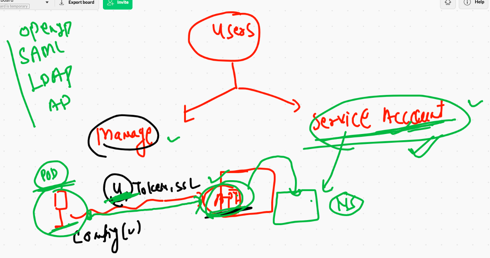

# K8s final day 

## deployment in k8s 


## reality of Deployment 


# Best practise we always use deployment 

## creating deployment 

```
 kubectl create deployment  ashudep1 --image=dockerashu/ows:v002  --dry-run=client -o yaml
apiVersion: apps/v1
kind: Deployment
metadata:
  creationTimestamp: null
  labels:
    app: ashudep1
  name: ashudep1
spec:
  replicas: 1
  selector:
    matchLabels:
      app: ashudep1
  strategy: {}
  template:
    metadata:
      creationTimestamp: null
      labels:
        app: ashudep1
    spec:
      containers:
      - image: dockerashu/ows:v002
        name: ows
        resources: {}
status: {}
❯ kubectl create deployment  ashudep1 --image=dockerashu/ows:v002  --dry-run=client -o yaml  >ashudep1.yaml

```

## COpy final new changes 

```
apiVersion: apps/v1
kind: Deployment
metadata:
  creationTimestamp: null
  labels:
    app: ashudep1
  name: ashudep1 # name of deployment 
  namespace: ashu-space 
spec:
  replicas: 1 # no of pod 
  selector:
    matchLabels:
      app: ashudep1
  strategy: {}
  template:
    metadata:
      creationTimestamp: null
      labels:
        app: ashudep1
    spec:
      containers:
      - image: dockerashu/ows:v002
        name: ows
        env: # a speicfig app  
        - name: x
          value: app2 
        resources: {}
status: {}


```


## NEw example of web app 

### app v1 

```
docker build -t  dockerashu/owsfinal:v001  https://github.com/redashu/oracletest.git\#main
Sending build context to Docker daemon  650.8kB
Step 1/7 : FROM oraclelinux:8.3
8.3: Pulling from library/oraclelinux
230d257ffbc9: Extracting [==================================>                ]  56.82MB/81.79MB

```

## deploying app in k8s cluster 

```
❯ kubectl  apply -f myapp.yml -n ashu-space
deployment.apps/helloashu created
❯ kubectl  get  deploy
NAME        READY   UP-TO-DATE   AVAILABLE   AGE
helloashu   1/1     1            1           11s
❯ 
❯ kubectl  get  rs
NAME                   DESIRED   CURRENT   READY   AGE
helloashu-795866dff9   1         1         1       16s
❯ 
❯ kubectl  get  po
NAME                         READY   STATUS    RESTARTS   AGE
helloashu-795866dff9-xqrwk   1/1     Running   0          20s

```

## creating service 

```
kubectl  expose deployment helloashu  --type NodePort  --port 1234 --target-port 80 --name ashusvc123
service/ashusvc123 exposed
❯ kubectl get svc
NAME         TYPE       CLUSTER-IP       EXTERNAL-IP   PORT(S)          AGE
ashusvc123   NodePort   10.102.158.104   <none>        1234:31394/TCP   8s


```
## scaling pod

```
❯ kubectl scale deployment helloashu --replicas=3
deployment.apps/helloashu scaled
❯ kubectl  get  po
NAME                         READY   STATUS    RESTARTS   AGE
helloashu-795866dff9-pzl6t   1/1     Running   0          4s
helloashu-795866dff9-t56l2   1/1     Running   0          4s
helloashu-795866dff9-xqrwk   1/1     Running   0          4m28s

```

## UPdating application 

### checking revsion number 

```
 kubectl describe  deploy helloashu
Name:                   helloashu
Namespace:              ashu-space
CreationTimestamp:      Fri, 12 Feb 2021 23:30:18 +0530
Labels:                 app=helloashu
Annotations:            deployment.kubernetes.io/revision: 1
Selector:               app=helloashu

```

## updating image in existing deployment 

```
kubectl  set  image  deployment helloashu owsfinal=dockerashu/owsfinal:v002
```

## rolling back 

```
❯ kubectl rollout undo  deployment helloashu
deployment.apps/helloashu rolled back

```
# history of deployment 

```
7372  kubectl  apply -f myapp.yml -n ashu-space 
 7373  kubectl  get  deploy 
 7374  kubectl  get  rs
 7375  kubectl  get  po 
 7376  kubectl  expose deployment helloashu  --type NodePort  --port 1234 --target-port 80 --name ashusvc123 
 7377  kubectl get svc 
 7378  kubectl scale deployment helloashu --replicas=3
 7379  kubectl  get  po 
 7380  history
 7381  docker build -t  dockerashu/owsfinal:v002  https://github.com/redashu/oracletest.git\#main
 7382  docker push dockerashu/owsfinal:v002 
 7383  kubectl get deploy
 7384  kubectl describe  deploy helloashu 
 7385  kubectl  set  image  deployment helloashu owsfinal=dockerashu/owsfinal:v002 
 7386  kubectl  get  po 
 7387  history
 7388  kubectl describe  deploy helloashu 
❯ kubectl rollout undo  deployment helloashu
deployment.apps/helloashu rolled back


```


## End deployment with LB & DNS 


## service 

```
 kubectl expose deploy helloashu  --type LoadBalancer --port 1245 --target-port 80 --name okcool
service/okcool exposed
❯ 
❯ kubectl get svc
NAME         TYPE           CLUSTER-IP       EXTERNAL-IP   PORT(S)          AGE
ashusvc123   NodePort       10.102.158.104   <none>        1234:31394/TCP   61m
nimitsvc1    NodePort       10.101.215.68    <none>        1234:31348/TCP   37m
okcool       LoadBalancer   10.104.188.229   <pending>     1245:32331/TCP   5s

```

##  Just ingress thing 


# storage in k8s 


## emptyDir type 

```
apiVersion: v1
kind: Pod
metadata:
  creationTimestamp: null
  labels:
    run: mypod1
  name: mypod1
spec:
  volumes: # IS for creating volume 
  - name: ashuvol1 # name of volume 
    emptyDir: {}  # blank it will create any random directory 
  containers:
  - image: alpine
    name: mypod1
    volumeMounts: # mounting volume  created from above
    - name: ashuvol1 # same name of volume 
      mountPath: /mnt/oracle # this directory will be created 
    command: ["/bin/sh","-c","while true;echo Hello >>/mnt/oracle/data.txt;sleep 5;done"]
    resources: {}
  dnsPolicy: ClusterFirst
  restartPolicy: Always
status: {}


```

## MUlti container POd example 

```
apiVersion: v1
kind: Pod
metadata:
  creationTimestamp: null
  labels:
    run: mypod1
  name: mypod1
spec:
  volumes: # IS for creating volume 
  - name: ashuvol1 # name of volume 
    emptyDir: {}  # blank it will create any random directory 
  containers:
  - image: alpine
    name: mypod1
    volumeMounts: # mounting volume  created from above
    - name: ashuvol1 # same name of volume 
      mountPath: /mnt/oracle # this directory will be created 
    command: ["/bin/sh","-c","while true;do echo Hello k8s >>/mnt/oracle/data.txt;sleep 5;done"]
    resources: {}
  - image: nginx # web app container 
    name: ashuc1
    ports:
    - containerPort: 80
    volumeMounts: # same volume 
    - name: ashuvol1
      mountPath: /usr/share/nginx/html/ # documentroot 

  dnsPolicy: ClusterFirst
  restartPolicy: Always
status: {}


```

## deploy

```
 kubectl  get po
NAME     READY   STATUS    RESTARTS   AGE
mypod1   2/2     Running   0          119s
❯ 

░▒▓ ~/Desktop/mypods ········································· kubernetes-admin@kubernetes/ashu-space ⎈  02:59:37 AM ▓▒░─╮
❯ kubectl exec -it  mypod1 -c  ashuc1  -- bash                                                                             ─╯
abc.json         ashudep1.yaml    ashupod1.yaml    ashusvc1.yaml    myapp.yml        pod3.yaml                       
alp.yml          ashunewpod.yaml  ashurc.yaml      emptype.yml      p.yml                                          
❯ kubectl exec -it  mypod1 -c  ashuc1  -- bash
root@mypod1:/# 
root@mypod1:/# cat  /etc/os-release 
PRETTY_NAME="Debian GNU/Linux 10 (buster)"
NAME="Debian GNU/Linux"
VERSION_ID="10"
VERSION="10 (buster)"
VERSION_CODENAME=buster
ID=debian
HOME_URL="https://www.debian.org/"
SUPPORT_URL="https://www.debian.org/support"
BUG_REPORT_URL="https://bugs.debian.org/"
root@mypod1:/# cd  /usr/share/nginx/html/
root@mypod1:/usr/share/nginx/html# ls
data.txt


```

## creating service 

```
❯ kubectl get po
NAME     READY   STATUS    RESTARTS   AGE
mypod1   2/2     Running   0          5m15s
❯ kubectl expose pod mypod1  --type NodePort --port 80
service/mypod1 exposed
❯ kubectl get svc
NAME     TYPE       CLUSTER-IP      EXTERNAL-IP   PORT(S)        AGE
mypod1   NodePort   10.104.69.200   <none>        80:31279/TCP   6s

```

## portainer deployment 

```
kubectl  create deployment  ashumin3  --image=portainer/portainer --dry-run=client -o yaml  >portainer.yml

```
## portainer 

```
apiVersion: apps/v1
kind: Deployment
metadata:
  creationTimestamp: null
  labels:
    app: ashumin3
  name: ashumin3
spec:
  replicas: 1
  selector:
    matchLabels:
      app: ashumin3
  strategy: {}
  template:
    metadata:
      creationTimestamp: null
      labels:
        app: ashumin3
    spec:
      nodeName: k8s-minion3
      volumes: # only for volume creation 
      - name: ashuwebvol
        hostPath: # docker socket 
         path: /var/run/docker.sock
         type: Socket 
      containers:
      - image: portainer/portainer
        name: portainer
        volumeMounts:
        - name: ashuwebvol
          mountPath: /var/run/docker.sock 
        ports:
        - containerPort: 9000
        resources: {}
status: {}


```
## service account 

```
 kubectl get  serviceaccount
NAME      SECRETS   AGE
default   1         25h
❯ kubectl get  serviceaccount  -n kube-public
NAME      SECRETS   AGE
default   1         30h
❯ kubectl get  sa  -n kube-public
NAME      SECRETS   AGE
default   1         30h
❯ 
❯ kubectl get  sa
NAME      SECRETS   AGE
default   1         25h
❯ kubectl get  secret
NAME                  TYPE                                  DATA   AGE
ashusec               kubernetes.io/dockerconfigjson        1      24h
default-token-zf29w   kubernetes.io/service-account-token   3      25h

```



