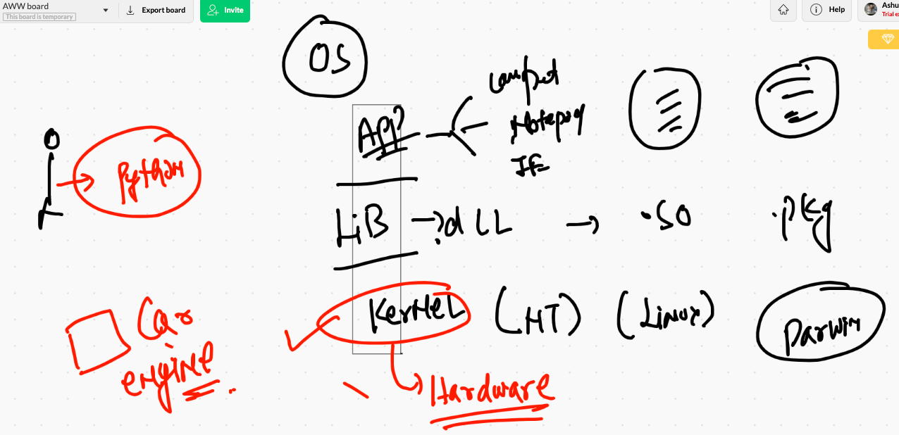
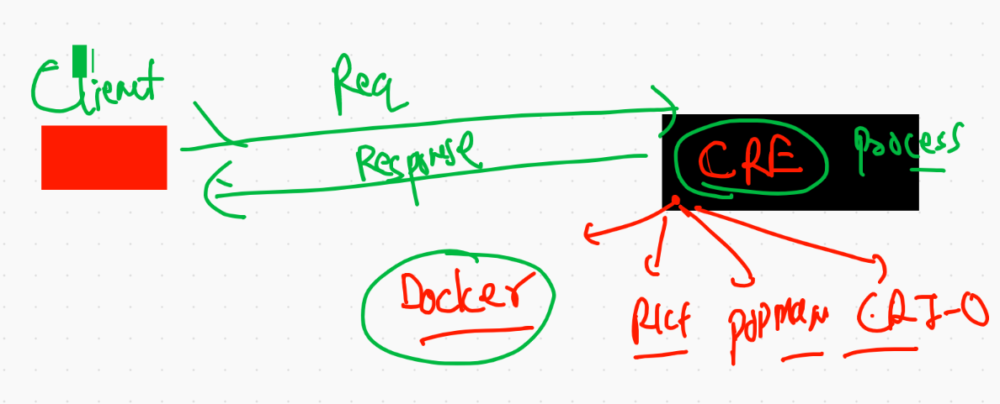

# Day1 starting 

## understanding OS kernel 




## vm vs container 


## container type 


## Container Runtime engine 




## Docker products 


## COnnecting to Remote Docker engine 

```
❯ docker  context  create   oracleDE  --docker  "host=tcp://3.210.139.97:2375"
oracleDE
Successfully created context "oracleDE"
❯ docker  context  ls
NAME                TYPE                DESCRIPTION                               DOCKER ENDPOINT               KUBERNETES ENDPOINT                        ORCHESTRATOR
ashude              moby                                                          tcp://3.84.170.96:2375                                                   
default *           moby                Current DOCKER_HOST based configuration   unix:///var/run/docker.sock   https://52.205.97.11:6443 (ashuproject1)   swarm
oracleDE            moby                                                          tcp://3.210.139.97:2375                                                  
❯ docker  context  use  oracleDE
oracleDE
❯ docker  context  ls
NAME                TYPE                DESCRIPTION                               DOCKER ENDPOINT               KUBERNETES ENDPOINT                        ORCHESTRATOR
ashude              moby                                                          tcp://3.84.170.96:2375                                                   
default             moby                Current DOCKER_HOST based configuration   unix:///var/run/docker.sock   https://52.205.97.11:6443 (ashuproject1)   swarm
oracleDE *          moby                                                          tcp://3.210.139.97:2375                                                  


```

## More options of Docker client 


## Container creation using container images


# Registry 

## public free registry 

[docker Hub](https://hub.docker.com/)

--

[IBM/Redhat](https://quay.io/)


--
 [Fedora](https://registry.fedoraproject.org/)
 
 
 ## Docker search 
 
 ```
 6325  docker  search  python 
 6326  docker  search  mysql
 6327  history
 6328  docker  search  dockerashu
 6329  docker  search  ashutoshh


```

## Docker images storage in Docker ENgine Host 

```
[root@ip-172-31-93-149 ~]# cd /var/lib/docker/
[root@ip-172-31-93-149 docker]# ls
builder  buildkit  containers  image  network  overlay2  plugins  runtimes  swarm  tmp  trust  volumes
[root@ip-172-31-93-149 docker]# cd  image
[root@ip-172-31-93-149 image]# ls
overlay2
[root@ip-172-31-93-149 image]# cd  overlay2/
[root@ip-172-31-93-149 overlay2]# ls
distribution  imagedb  layerdb  repositories.json
[root@ip-172-31-93-149 overlay2]# cd  imagedb/
[root@ip-172-31-93-149 imagedb]# ls
content  metadata
[root@ip-172-31-93-149 imagedb]# cd content/
[root@ip-172-31-93-149 content]# ls
sha256
[root@ip-172-31-93-149 content]# cd sha256/
[root@ip-172-31-93-149 sha256]# ls
22667f53682a2920948d19c7133ab1c9c3f745805c14125859d20cede07f11f9
d23bdf5b1b1b1afce5f1d0fd33e7ed8afbc084b594b9ccf742a5b27080d8a4a8
e32be9a6f71fb552055421fdeebbd6e4075055865d26f7d362cb7a24dd46d735
e50c909a8df2b7c8b92a6e8730e210ebe98e5082871e66edd8ef4d90838cbd25

```

# Container parent process 


## First ever container 

```
❯ docker  images
REPOSITORY   TAG       IMAGE ID       CREATED       SIZE
python       latest    e32be9a6f71f   6 days ago    885MB
busybox      latest    22667f53682a   6 days ago    1.23MB
alpine       latest    e50c909a8df2   10 days ago   5.61MB
java         latest    d23bdf5b1b1b   4 years ago   643MB
❯ 
❯ docker  run    alpine:latest   ping 127.0.0.1
PING 127.0.0.1 (127.0.0.1): 56 data bytes
64 bytes from 127.0.0.1: seq=0 ttl=255 time=0.041 ms
64 bytes from 127.0.0.1: seq=1 ttl=255 time=0.066 ms
64 bytes from 127.0.0.1: seq=2 ttl=255 time=0.043 ms
64 bytes from 127.0.0.1: seq=3 ttl=255 time=0.044 ms
64 bytes from 127.0.0.1: seq=4 ttl=255 time=0.044 ms
64 bytes from 127.0.0.1: seq=5 ttl=255 time=0.045 ms
64 bytes from 127.0.0.1: seq=6 ttl=255 time=0.044 ms
64 bytes from 127.0.0.1: seq=7 ttl=255 time=0.043 ms
^C64 bytes from 127.0.0.1: seq=8 ttl=255 time=0.063 ms

--- 127.0.0.1 ping statistics ---
9 packets transmitted, 9 packets received, 0% packet loss
round-trip min/avg/max = 0.041/0.048/0.066 ms
❯ docker  ps
CONTAINER ID   IMAGE     COMMAND   CREATED   STATUS    PORTS     NAMES
❯ docker  ps -a
CONTAINER ID   IMAGE           COMMAND            CREATED          STATUS                      PORTS     NAMES
514b58522e78   alpine:latest   "ping 127.0.0.1"   56 seconds ago   Exited (0) 46 seconds ago             jovial_banach

```


## Best practise to create container 

```
❯ docker  run --name  ashuc1  -d   alpine   ping 127.0.0.1
c6e15a538aa40c6f7265212e844fa025d50f3ebd66fe2bf8866b9f495de73783
❯ 
❯ docker  ps
CONTAINER ID   IMAGE           COMMAND            CREATED              STATUS              PORTS     NAMES
c6e15a538aa4   alpine          "ping 127.0.0.1"   4 seconds ago        Up 3 seconds                  ashuc1

```

## Few more docker client instruction for container 

```
6370  docker  run --name  ashuc1  -d   alpine   ping 127.0.0.1 
 6371  docker  ps
 6372  history
 6373  docker  ps
 6374  docker  logs   ashuc1  
 6375  docker  logs  -f  ashuc1  
 6376  history
 6377  docker  ps
 6378  docker  stop  ashuc1
 6379  docker  ps 
 6380  docker  ps  -a
 6381  docker  start  ashuc1
 6382  docker  ps 
 6383  history
 6384  docker  ps 
 6385  docker  kill  ashuc1
 6386  docker  ps 
 6387  docker  start  ashuc1
 6388  docker  ps

```

## child process for container 

```
docker  exec  -d  ashuc1  ping www.google.com   

```

## accessing container shell

```
❯ docker  exec   -it  ashuc1   sh
/ # 
/ # 
/ # uname 
Linux
/ # uname -r
4.14.214-160.339.amzn2.x86_64
/ # cat  /etc/os-release 
NAME="Alpine Linux"
ID=alpine
VERSION_ID=3.13.1
PRETTY_NAME="Alpine Linux v3.13"
HOME_URL="https://alpinelinux.org/"
BUG_REPORT_URL="https://bugs.alpinelinux.org/"
/ # exit


```
## removing container persistently 

```
6397  docker  exec   -it  ashuc1   sh 
❯ docker kill ashuc1
ashuc1
❯ docker  rm  ashuc1
ashuc1
❯ docker  ps -a
CONTAINER ID   IMAGE           COMMAND            CREATED          STATUS                      PORTS     NAMES
58e5379f8496   alpine:latest   "ping 127.0.0.1"   10 minutes ago   Exited (0) 10 minutes ago             blissful_leavitt
8c1451dfd81b   alpine          "ping 127.0.0.1"   15 minutes ago   Up 4 minutes                          vinodalphine
be826cb462c2   alpine:latest   "ping 127.0.0.1"   20 minutes ago   Up 20 minutes                         interesting_swartz
514b58522e78   alpine:latest   "ping 127.0.0.1"   22 minutes ago   Exited (0) 22 minutes ago             jovial_banach


```

## Docker quick revision 


## Containerization of your app 


# First docker image build 

```
❯ docker  build  -t  ashupython:v1  .
Sending build context to Docker daemon     64kB
Step 1/7 : FROM python
 ---> e32be9a6f71f
Step 2/7 : MAINTAINER  ashutoshh@linux.com , 9509957594
 ---> Running in 493ffa835680
Removing intermediate container 493ffa835680
 ---> 6bba0fa18024
Step 3/7 : RUN  mkdir  /mycode
 ---> Running in af9bbeb11a79
Removing intermediate container af9bbeb11a79
 ---> fe0d18362664
Step 4/7 : COPY while.py /mycode/while.py
 ---> e706bbab2355
Step 5/7 : WORKDIR /mycode
 ---> Running in 9eb52edaf84d
Removing intermediate container 9eb52edaf84d
 ---> ebb5301b8331
Step 6/7 : RUN chmod +x while.py
 ---> Running in 0475126350f1
Removing intermediate container 0475126350f1
 ---> 0e71db017c95
Step 7/7 : CMD ["python","while.py"]
 ---> Running in 296a514b7245
Removing intermediate container 296a514b7245
 ---> 3dffd29ea06b
Successfully built 3dffd29ea06b
Successfully tagged ashupython:v1

```

## creating container from last build image

```
❯ docker  run --name ashuc2 -it -d  ashupython:v1
db1b7b70b69328713199c3ee93d589e565ef0c0b5c4353611f71e883cb5a99dc
❯ docker  ps
CONTAINER ID   IMAGE           COMMAND             CREATED         STATUS         PORTS     NAMES
db1b7b70b693   ashupython:v1   "python while.py"   5 seconds ago   Up 3 seconds             ashuc2

```

## checking output of parent process

```
 docker  logs -f  ashuc2 
```

## MUlti stage dockerfile

```
❯ ls
Dockerfile        README.md         custom.dockerfile while.py
❯ docker  build  -t  ashupython:distrov1  -f  custom.dockerfile  .
Sending build context to Docker daemon  65.54kB
Step 1/10 : FROM python as Builder
 ---> e32be9a6f71f
Step 2/10 : MAINTAINER  ashutoshh@linux.com , 9509957594
 ---> Using cache
 ---> 6bba0fa18024
Step 3/10 : RUN  mkdir  /mycode
 ---> Using cache
 ---> fe0d18362664
Step 4/10 : COPY while.py /mycode/while.py
 ---> Using cache
 ---> 6f120757ed58
Step 5/10 : WORKDIR /mycode
 ---> Using cache
 ---> a1c86ceaf548
Step 6/10 : RUN chmod +x while.py
 ---> Using cache
 ---> 4dc04d30269d
Step 7/10 : FROM gcr.io/distroless/python3
latest: Pulling from distroless/python3
9e4425256ce4: Pull complete 
a3e61620654b: Pull complete 
e708be98c58f: Pull complete 
c2442dd585ef: Pull complete 
Digest: sha256:58087520b3c929fe77e1ef3fc95062dbe80bbda265e0e7966c4997c71a9636ea
Status: Downloaded newer image for gcr.io/distroless/python3:latest
 ---> 868c100eaedc
Step 8/10 : COPY --from=Builder /mycode /mycode
 ---> d5eff98d6396
Step 9/10 : WORKDIR /mycode
 ---> Running in 803198074dfd
Removing intermediate container 803198074dfd
 ---> 2c74f9e4edef
Step 10/10 : CMD ["python","while.py"]
 ---> Running in aea311af241a
Removing intermediate container aea311af241a
 ---> 0c3b38a4fa4e
Successfully built 0c3b38a4fa4e
Successfully tagged ashupython:distrov1

```

# Docker 

Docker  assignment : 

```
Q1.   create  two containers and do the given things 

Image must be alpine 
Name of container <yourname>c1 & <yourname>c2
Parent process you can choose accordingly 
Create two files in container1 named aa.txt & bb.txt 
Now copy aa.txt into second container

```


# after build creating container 

```
 docker run -d --name ashuweb -p  2211:80  ashuol:httpdv1
3062504b51ac16c86ecd78d7146d8bfe0199c6ac6a06fef62e15681d7a565ae4
❯ docker ps
CONTAINER ID   IMAGE                 COMMAND                  CREATED          STATUS             PORTS                  NAMES
3062504b51ac   ashuol:httpdv1        "httpd -DFOREGROUND"     5 seconds ago    Up 2 seconds       0.0.0.0:2211->80/tcp   ashuweb
0d5d7bcf6e9e   viswa-webapp1:v1      "httpd -DFOREGROUND"     3 minutes ago    Up 3 minutes       80/tcp   

```

## image registry to push docker images


## image push to docker hub 

```
❯ docker  tag   ashuol:httpdv1    dockerashu/ashuol:httpd1
❯ docker images  |   grep -i ashu
dockerashu/ashuol           httpd1     b42d5d0662b0   31 minutes ago      344MB
ashuol                      httpdv1    b42d5d0662b0   31 minutes ago      344MB
ashupython                  distrov2   1b67d947dab9   About an hour ago   49.6MB
ashupython                  distrov1   0c3b38a4fa4e   About an hour ago   49.6MB
ashupython                  v1         07862c1d3e10   2 hours ago         885MB
❯ docker login  -u dockerashu
Password: 
Login Succeeded
❯ docker push dockerashu/ashuol:httpd1
The push refers to repository [docker.io/dockerashu/ashuol]
2b78f5bac9d7: Pushed 
845c43d28e2a: Pushed 
d0054f212bd1: Mounted from library/oraclelinux 
httpd1: digest: sha256:f67f28d7b2b0986c709ed31818fca81ec9abc4191565e44aef3fdcedd4c22184 size: 950
❯ docker logout  -u dockerashu
unknown shorthand flag: 'u' in -u
❯ docker logout
Removing login credentials for https://index.docker.io/v1/

```

