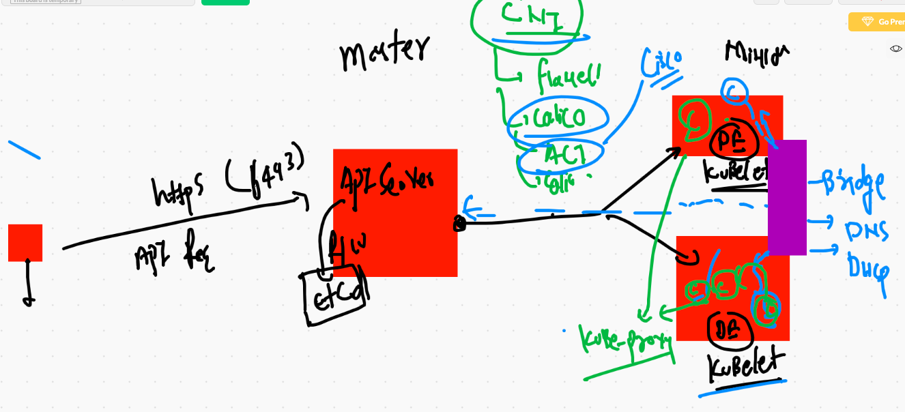

# COmpose start 


# Docker compose version history 

[version](https://docs.docker.com/compose/compose-file/)

## INstall docker compose 

[compose]('https://docs.docker.com/compose/install/')

# COMpose examples 

## Example 1 

```
version: "3.8" # compose file version
services: # to define one or more container applications
 ashuapp1: # name of app 
  image: alpine # image 
  container_name: ashuc1 # name of container 
  command: ping 127.0.0.1 # parent process
  restart: always  # restart policy 
  
```

## RUnning compose file

```
❯ docker-compose up  -d
Creating network "composedeploy_default" with the default driver
Creating ashuc1 ... done
❯ docker-compose ps
 Name       Command       State   Ports
---------------------------------------
ashuc1   ping 127.0.0.1   Up      

```
## more instruction 

```
❯ docker-compose   stop
Stopping ashuc1 ... done
❯ docker-compose   start
Starting ashuapp1 ... done
❯ docker-compose   kill
Killing ashuc1 ... done
❯ docker-compose   ps
 Name       Command        State     Ports
------------------------------------------
ashuc1   ping 127.0.0.1   Exit 137        
❯ docker-compose   start
Starting ashuapp1 ... done

```

## Example 2 

```
version: "3.8" # compose file version
services: # to define one or more container applications
 ashuapp1: # name of app 
  image: alpine # image 
  container_name: ashuc1 # name of container 
  command: ping 127.0.0.1 # parent process
  restart: always  # restart policy 

 ashuapp2: # second app
  image: nginx
  container_name: ashuc2
  ports:
   - "1122:80" # - means array in YAML 
  restart: always # best practise to use (optional)

# docker run -d --name ashuc2 -p 1122:80 --restart always nginx 

```

## more commands 

```
6907  docker-compose up -d
 6908  docker-compose ps 
 6909  docker-compose kill 
 6910  docker-compose start  ashuapp1 
 6911  docker-compose ps
 6912  docker-compose kill ashuapp1
 6913  docker-compose start
 6914  docker-compose ps
 6915  docker-compose logs ashuapp1
 6916  docker-compose logs ashuapp2
❯ docker-compose down
Stopping ashuc2 ... done
Stopping ashuc1 ... done
Removing ashuc2 ... done
Removing ashuc1 ... done
Removing network composedeploy_default


```

## Example 3 

```
version: "3.6"
networks: # to create network 
 ashubr1234: # name of network with default bridge driver
volumes: # to create volume 
 ashuvol123: # name of volume 

services:
 ashuapp11:
  image: nginx
  container_name: xcashu1
  networks: # for using networks 
  - ashubr1234
  volumes: # using volume 
  - ashuvol123:/mnt/oracle  
  ports:
  - 1199:80 
  
 ```
 
 ## deployment 
 
 ```
 ❯ ls
ashu.yml            docker-compose.yaml
❯ docker-compose -f  ashu.yml up  -d
Creating network "composedeploy_ashubr1234" with the default driver
Creating volume "composedeploy_ashuvol123" with default driver
Creating xcashu1 ... done
❯ docker-compose -f  ashu.yml   ps
 Name                Command               State          Ports        
-----------------------------------------------------------------------
xcashu1   /docker-entrypoint.sh ngin ...   Up      0.0.0.0:1199->80/tcp
❯ docker-compose -f  ashu.yml  down
Stopping xcashu1 ... done
Removing xcashu1 ... done
Removing network composedeploy_ashubr1234

```
# Example 3 

```
version: '3.8'
services:
  ashujsp1:
    image: dockerashu/ashujava:webappv1 # name of image i want to build
    build: # to build image from Dockerfile 
      context: . # location of Dockerfile 
      dockerfile: Dockerfile # name of dockerfile 
    container_name: ashujavac1
    ports:
      - 5566:8080 
    restart: always 
    
  ```
  
  ## compsoe command history 
  
  ```
  6925  docker-compose -f  ashu.yml up  -d
 6926  docker-compose -f  ashu.yml   ps
 6927  docker-compose -f  ashu.yml  down
 6928  history
 6929  docker volume  ls
 6930  docker volume  inspect  ashuvol2  
 6931* ssh -i Downloads/macdocker.pem ec2-user@3.210.139.97
 6932  history
 6933  docker volume ls
 6934  docker  pull tomcat 
 6935  docker  inspect  tomcat 
 6936  history
 6937  ls
 6938  cd  javawebapp-master
 6939  ls
 6940  docker-compose up -d 
 6941  docker-compose ps
 6942  docker-compose down 
 6943  docker-compose down --remove-orphans
 6944  docker-compose up  --build   -d  
 6945  docker-compose ps


```

# COntainer orchestration engines 


## K8s more info 


## k8s architecture  Pic 1


## k8s arch pic 2


## k8s arch final



